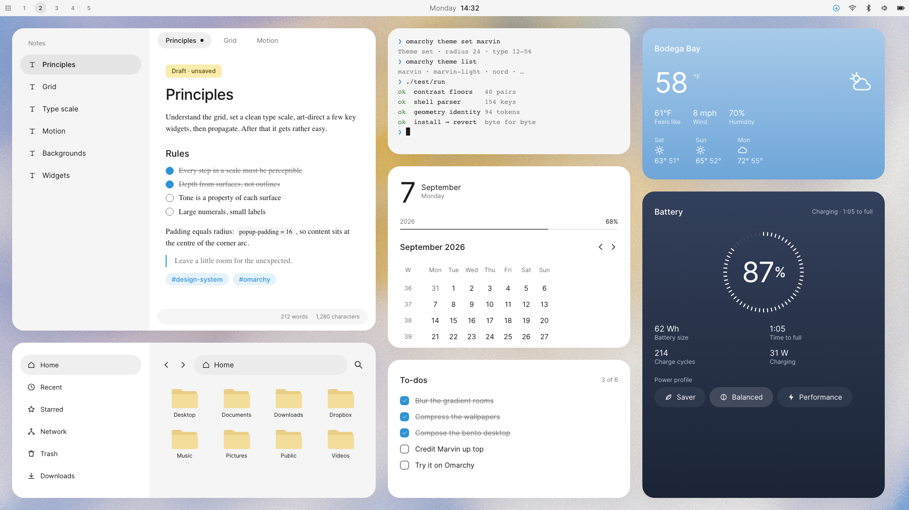
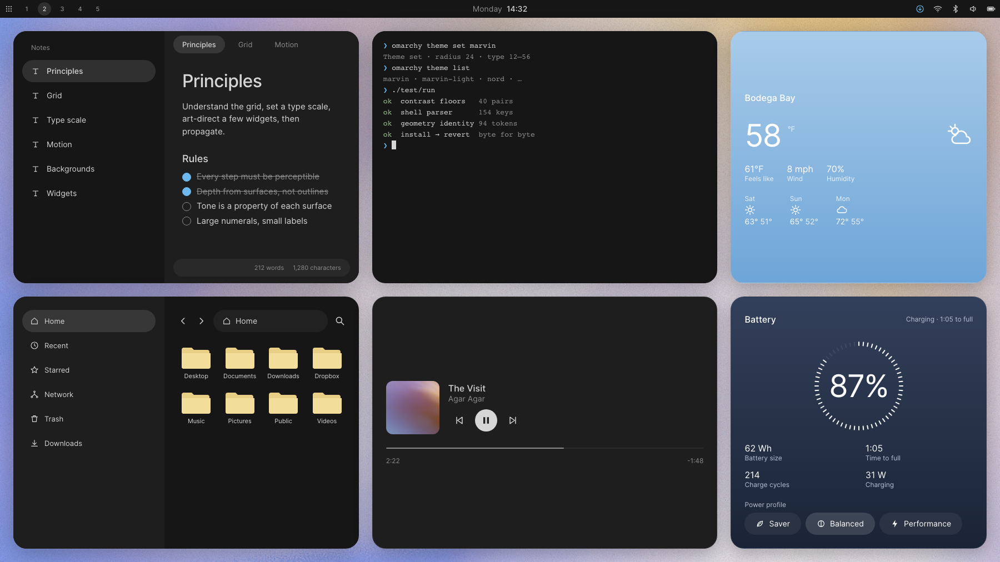
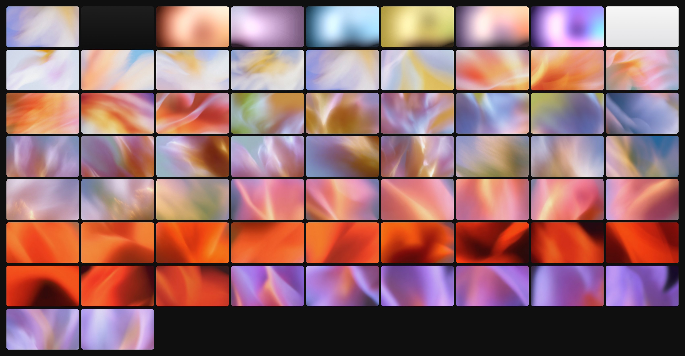
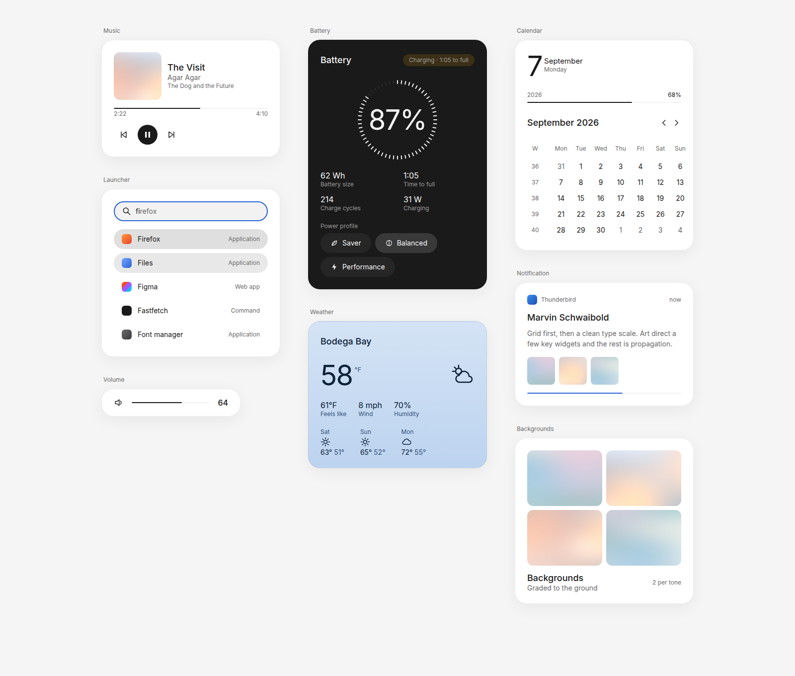
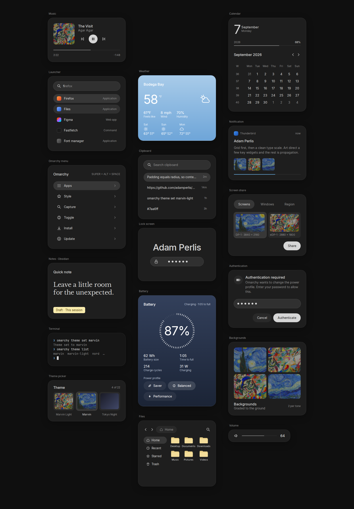
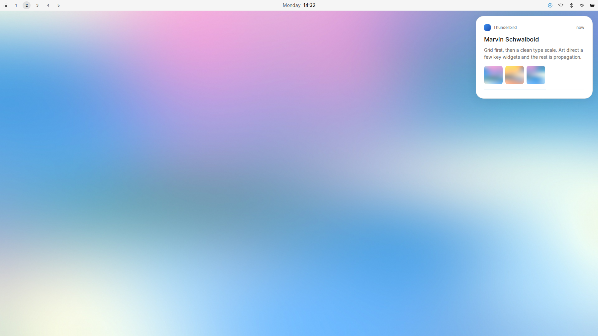
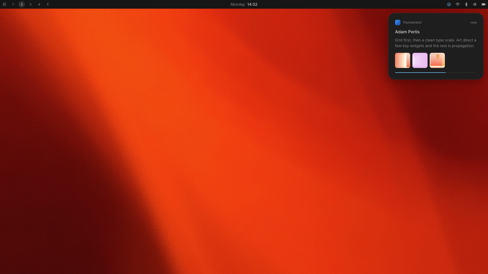
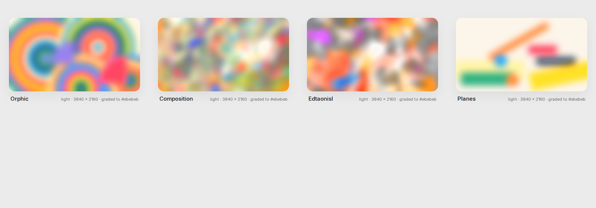

# Marvin

<p align="center"><em>Inspired by, and named for, <a href="https://x.com/MSchwaibold">Marvin Schwaibold</a> — <a href="https://x.com/MSchwaibold/status/2096059496812716307">the post</a> that started this whole project.</em></p>

A design system for [Omarchy 4](https://omarchy.org), delivered as a theme, a
reversible config layer, and fourteen restyled widgets — with 65 wallpapers
included.

A composed desktop under Marvin — the Notes app, Files and a terminal
alongside weather, calendar, to-dos and battery modules:





Tone is a property of each surface: weather is a gradient, the battery card is
inverted with a ring of ticks, state is a soft-fill chip, and the rest stay
quiet.

And the 65 wallpapers it ships with — blurred gradient rooms drawn from the
palette, plus soft abstractions:



## Install

Copy-paste the lot:

```
omarchy theme install https://github.com/adamperlis/omarchy-marvin
omarchy theme set marvin
~/.config/omarchy/themes/marvin/install/marvin
```

That's the whole install, no hand-edits: theme, fonts, GTK, all widgets placed
on the bar, Obsidian, and auto-update. The installer restarts the shell itself
at the end (the bar vanishes and returns — a few seconds). Weather auto-detects
by IP; restart Obsidian once to pick up its theme.

Details and a step-by-step breakdown follow.

**1. The theme** — two commands:

```
omarchy theme install https://github.com/adamperlis/omarchy-marvin
omarchy theme set marvin
```

That is everything a theme file can carry: the palette, type scale, state
model, quiet neutral window borders, the restyled widget styling, the boot
logo, and all 65 wallpapers. It has to look intentional on its own — a plain
install is the honest baseline. Cycle wallpapers with **SUPER + CTRL + SPACE**,
or pick one from the Omarchy menu (**SUPER + ALT + SPACE → Style → Background**).

**2. The config layer** — for what a theme file *cannot* carry in Omarchy 4
(window rounding and gaps, the shell's typeface, shadows, compositor motion,
widget layouts):

```
~/.config/omarchy/themes/marvin/install/marvin
```

Adds, in order:

- **`marvin-light`** — the same geometry over a light tone table.
  `omarchy theme set marvin-light` to switch.
- **Inter for the shell** — a fontconfig rule scoped to the shell's process, so
  your terminal font is untouched and `omarchy font set` keeps working. Inter
  and Libre Baskerville install to your user font directory from `fonts/`; no
  package, no `sudo`.
- **GTK apps** — Marvin's palette as GTK 3 and libadwaita (GTK 4) named
  colours, so file choosers, **save dialogs** and GTK apps match the theme.
  Written to `~/.config/gtk-3.0/gtk.css` and `gtk-4.0/gtk.css`, re-copied per
  tone by `marvin-mode` (colours only — no app's layout is touched).
- **Hyprland** — rounding 16, gaps 8 inside and 16 at the edge, a 1px
  theme-coloured focus border, a shadow in place of surface outlines, and the
  motion scale. Written to `~/.config/hypr/marvin.lua`, required from your
  `hyprland.lua` by one marked line; nothing else of yours is edited.
- **Widgets** — sixteen plugins: fourteen restyled clones of the built-ins,
  plus two new ones — a light/dark **mode** control and a **to-dos** list.
  Enabled if the shell is running.
- **`marvin-mode` · `marvin-update` · `marvin-todo`** — helpers installed to
  `~/.local/bin`. The **`marvin.mode`** widget (a sun in light, a moon in dark)
  opens a **control panel** on left click — appearance (**Light / Dark / Auto**,
  where Auto switches by time of day), a **wallpaper picker** with previews,
  reduce motion, and **auto-update** (on by default) — and right click is a
  quick flip. Your appearance choice is remembered across updates. The **`marvin.todos`** widget is a to-do list stored in `~/todos.md`, so
  Obsidian and OmaWrite share the same checklist. Light/dark also works from the
  command line:

  ```
  marvin-mode toggle              # flip light ↔ dark
  marvin-mode system              # match the system colour-scheme once
  marvin-mode follow-on           # keep matching it (a user service)
  marvin-mode schedule 07:00 19:00  # light at 07:00, dark at 19:00, daily
  ```

  These two clone nothing, so nothing places them automatically — the installer
  puts `marvin.mode` and `marvin.todos` on the right of the bar for you (first
  install only; it won't touch your layout on an update). Move them by editing a
  `bar.layout` array in `~/.config/omarchy/shell.json` if you'd rather.

- **Obsidian** — Marvin's note styling (`obsidian.css`) is installed as a theme
  called *Marvin* in every vault you've opened, and activated if that vault is
  still on the default theme. Restart Obsidian once to see it. (Only vaults
  Obsidian has registered are found; open a new vault once, then re-run the
  installer.)

It snapshots every file it touches (and the active theme) first, so
`install/marvin --revert` restores everything byte-for-byte (removes any
schedule, and drops the Obsidian theme), and `install/marvin --status` shows
what is installed.

**3. Widgets by hand** (optional) — to enable them one at a time instead
(recommended for a first look), skip the installer's enable step and:

```
omarchy-shell shell rescanPlugins
omarchy plugin enable marvin.weather      # then marvin.clock, marvin.power, marvin.media …
```

Enabling a clone replaces the built-in in its bar slot; disabling it brings the
built-in back. Plugins are unsandboxed QML and land disabled so you can read
them first — see [`plugins/README.md`](plugins/README.md).

**Weather** is placed for you by the installer (`marvin.weather` in the center).
If you ever need to place it by hand — Marvin's build, the styled clone, not
stock `omarchy.weather`:

```
omarchy plugin enable marvin.weather --section center
```

It appears as a cloud icon the moment it's enabled and detects your location
from your IP, then fills in with the current condition and temperature. (If you
only ever see a blank slot, you likely enabled stock `omarchy.weather` instead —
that one hides itself until its own fetch returns. Use `marvin.weather`.)

Then set your city right in the popup: click the location label at the top of
the weather card and type a city. To pin the unit, add it to the widget's entry
in `~/.config/omarchy/shell.json`, e.g. `{ "id": "marvin.weather", "unit":
"fahrenheit" }`, then `omarchy-restart-shell`. (Left off, it follows your
locale.)

**Staying up to date.** The config layer turns on **auto-update by default** —
a daily user timer that pulls the latest and re-applies it without disturbing
your wallpaper. Turn it off and the gear grows a small blue dot when the
checkout falls behind, with an **Update now** button in the panel that pulls
and re-applies in place. Toggle auto-update in the `marvin.mode` panel, or by
hand:

```
marvin-update                  # pull + re-apply right now
marvin-update --check          # is a newer version waiting? (no changes)
marvin-update --enable         # daily timer (on by default)
marvin-update --disable        # turn auto-update off
marvin-update --status
```

Omarchy has no auto-update for third-party themes, so this is Marvin's own; the
bare-hands version is `cd ~/.config/omarchy/themes/marvin && git pull`.

Omarchy's stock look is assembled rather than designed: an irregular spacing
ramp, six type sizes crammed between 10 and 16px, every surface the same
colour with a gradient border doing the work of depth, hover and keyboard
focus drawn identically. Marvin replaces that with a small number of rules
and applies them everywhere — the bar, every popup, the launcher,
notifications, the lock screen, the window manager's motion — so the desktop
reads as one object.

Named for [Marvin Schwaibold](https://x.com/MSchwaibold), and owed to him
from the first pixel. This whole project began with [the post that started
it](https://x.com/MSchwaibold/status/2096059496812716307) — we saw it,
couldn't stop thinking about it, and set out to build a desktop that lived up
to it. The method is entirely his: understand the grid, set a clean type
scale, art-direct a few key widgets, then propagate. So is the visual
reference — his widget studies, with their fixed-width cards on a fine grid,
generous radius, no borders, two text tones, a rationed accent, and large
numerals over small labels. We only carried it, admiringly, into Omarchy. He
is not involved in this project; the name is a credit and a thank-you, not an
endorsement.

Every restyled widget, at the token values:





The wallpaper is the ground the whole system sits on — an empty workspace
with one notification, then the shipped backgrounds themselves:







These are renders from the tokens, not screenshots of the shell — see
[Testing it](#testing-it).

## The system in one screen

| | Rule | Value |
|---|---|---|
| **Grid** | base 4, module 8, unit 32 | bar 32; rows and controls 40 |
| **Radius** | one radius for everything | 24px — cards, windows; controls are pills |
| **Padding** | equals the radius | 24px, so content sits at the centre of the corner arc |
| **Type** | Inter, pinned scale, every step perceptible | 12 / 14 / 16 / 18 / 24 / 56; hero numerals regular weight, tracked −0.03em |
| **Colour** | true-neutral ramp, one accent, one attention role | one sky blue, `#2f93d3` light / `#6db8ee` dark, pulled from the reference and used for accent and attention alike; status is muted text, or the reference's pale-yellow draft chip |
| **Text** | two tones, no third | foreground and muted |
| **Depth** | surfaces, not outlines | a hairline at 10% and a wide faint shadow; no dividers, no structural borders |
| **Tone** | a property of each surface | bar is base, popups are raised, weather is a sky that follows the hour (day, sunset, night), battery is inverted |
| **State** | emphasis rises in one direction; focus ≠ hover | fills 0.04 → 0.05 → 0.07 → 0.09 in light (0.06 → 0.10 → 0.14 → 0.18 in dark); focus is the selected fill plus a 1px text-colour ring, never an accent outline |
| **Progress** | a hairline | 2px, track at 0.08, fill muted (the reference's played portion is mid-grey) or accent |
| **Motion** | a scale, exits faster than entrances | 120 / 200 / 320 ms, exits at 0.6; workspaces slide, borders don't linger |
| **Icons** | Material Design Icons on their own grid | 16 / 20 / 24 |

Every one of those is measured, not eyeballed: contrast floors, parser
compatibility, dark/light geometry identity and the install/revert round-trip
run under `./test/run`. The reasoning behind each rule, and what is still
open, is in [`docs/principles.md`](docs/principles.md). How the pieces fit
together is in [`docs/system.md`](docs/system.md).

## Apps and surfaces

Everything in the grid above is a surface the system actually reaches:

| Surface | How | Where |
|---------|-----|-------|
| Bar, launcher, the Omarchy menu, clipboard manager, emoji picker, theme picker, notifications, OSD, tooltips, popups | `shell.toml` tokens — `[bar] [launcher] [menu] [image-picker] [notifications] [popups] [tooltip]` | theme |
| Every widget card — weather, clock, battery, media, audio, network, … | fourteen `clonedFrom` plugins | config layer |
| Lock screen, authentication dialog | `[lock]` and `[polkit]` tokens | theme |
| Notes (Obsidian) | `obsidian.css`, synced into every vault by Omarchy | theme |
| Screen-share picker | `hyprland-preview-share-picker.css` | theme |
| Files and every GTK app | Inter and the accent via `gsettings` | config layer |
| Windows: rounding, gaps, shadow, motion, group bar | `hypr/marvin.lua` | config layer |
| btop, Chromium, Helix | curated theme files — `btop.theme`, `chromium.theme`, `helix.toml`, generated from the palette | theme |
| Terminals, VS Code, Claude Code, Neovim | colours from `colors.toml` through Omarchy's templates | theme |
| Boot splash | `unlock.png` | theme |

Notes get a serif for the text itself — Libre Baskerville, falling back to Noto
Serif — and Inter for everything around it. The reference does exactly this
and it is the one place a second voice belongs: the chrome is the system's,
the words are yours.

What could still be customised, and why it is not yet:

- **The login screen (SDDM)** — a fixed theme installed by root; reaching it
  needs `sudo` and a rebuild, which the config layer deliberately avoids.
- **GTK window chrome** — libadwaita accepts a `gtk.css` for header bars and
  sidebars, but rules there leak into every GTK app unevenly; font and
  accent through `gsettings` was the safe part.
- **VS Code, Neovim beyond colour** — a git-installed theme cannot ship their
  config (`vscode.json` names an extension; editor Lua runs code), so they take
  the palette from `colors.toml` and nothing more. btop, Chromium and Helix
  *do* accept a shipped file, and Marvin ships one for each.
- **Firefox, Signal, Spotify, LibreOffice** — not themed by Omarchy at all.

The system reaches past the shell into the apps Omarchy installs, in two
ways:

- **Shipped by the theme**, so a plain install gets them: `obsidian.css`
  restyles the Notes app entirely — Inter, radius 16, borderless panes,
  neutral headings, chips for tags, monospace only inside code — and
  `hyprland-preview-share-picker.css` does the same for the screen-share
  picker. Omarchy syncs both into place on every theme switch.
- **Set by the config layer**, because they are settings rather than theme
  files: Files and every GTK app get Inter and the blue accent through
  `gsettings` (snapshotted, restored on revert), and Hyprland's group bar
  gets Inter at body size on a 32px row. The fonts themselves — Inter and
  Libre Baskerville, both OFL — are vendored under `fonts/` and installed per user,
  so nothing needs a package manager or `sudo`.

Beyond those, Marvin ships curated theme files for **btop** (`btop.theme`),
**Chromium** (`chromium.theme`) and **Helix** (`helix.toml`), all generated
from `colors.toml` by `tools/appcss.py` so the two tones stay in step. The
terminals, VS Code, Claude Code and Neovim take the palette from `colors.toml`
through Omarchy's templates, and colour is all they accept.

Monospace survives in exactly two places: terminals and code. Nowhere else.

## Put it back

```
install/marvin --revert
```

Restores every touched file byte for byte, removes what did not exist,
re-enables the built-in widgets, and sets your previous theme again. Then, if
you want the theme gone too: `omarchy theme remove marvin`. The only thing
left behind is the Inter package if the installer added it
(`sudo pacman -Rns inter-font`).

This is tested: `test/install-revert` installs against Omarchy's stock
config, simulates the shell enabling the clones, reverts, and fails unless
`~/.config` is identical to before.

## Testing it

Nothing in this repository has been rendered by the Omarchy shell — it was
built against upstream's source and scripts, not on a desktop. The first
real look is yours. [`docs/testing.md`](docs/testing.md) gives the order to
judge it in (theme alone, then config layer, then widgets one at a time with
the shell journal open) and what to send back.

## Publishing it

Marvin is a normal Omarchy theme: a public git repository you install by URL.
To share your own fork:

- Make the repository public. Anyone can then install it with
  `omarchy theme install https://github.com/<you>/<repo>`, or by pasting the
  URL into the Omarchy menu (**SUPER + ALT + SPACE → Install**).
- Omarchy lists a theme in its selection menu by repository name, stripping
  the `omarchy-` prefix and `-theme` suffix — so `omarchy-marvin` shows as
  *marvin*. The fuller convention is `omarchy-<name>-theme`; either resolves
  to the same display name.
- To be featured on Omarchy's official extra-themes page, open a pull request
  against [`omarchy-site`](https://github.com/basecamp/omarchy-site).

Wallpapers a user drops into `~/.config/omarchy/backgrounds/<theme>/` appear
alongside the shipped ones, so anyone can extend the set without forking.

## Repository map

| Path | What |
|------|------|
| `colors.toml`, `shell.toml`, `icons.theme` | The theme. Dark. |
| `obsidian.css`, `hyprland-preview-share-picker.css` | The Notes app and the share picker, restyled by the theme. |
| `btop.theme`, `chromium.theme`, `helix.toml` | btop, Chromium and Helix, in the palette. Generated by `appcss.py`. |
| `gtk.css` | GTK 3 / libadwaita named colours for GTK apps and save dialogs. Generated by `appcss.py`; installed by the config layer. |
| `bin/marvin-mode` | Light/dark control — toggle, schedule, or follow the system. Installed by the config layer. |
| `bin/marvin-update` | Pull the latest Marvin and re-apply it, keeping your wallpaper. Optional daily timer. |
| `bin/marvin-todo` | The to-do list in `~/todos.md`; backs the `marvin.todos` widget. |
| `light/` | The light sibling: same geometry, different tone table. |
| `backgrounds/`, `light/backgrounds/` | 65 wallpapers: a signature default, blurred gradient rooms graded to the ground (both tones), a light mist gradient, and 56 soft abstractions (dark). |
| `preview.png`, `preview-unlock.png`, `unlock.png` | Theme-switcher preview and the Plymouth boot logo. |
| `config/hypr/marvin.lua` | Rounding, gaps, border, shadow, motion. |
| `config/fontconfig/60-marvin-shell.conf` | Inter for `quickshell` only. |
| `install/marvin` | Installs the config layer; `--revert`, `--status`. |
| `plugins/marvin.*` | Fourteen restyled clones of the built-in widgets. |
| `tools/restyle.py` | The rules as a script; builds a widget from upstream's. |
| `tools/background.py` | Grades a painting (or a palette) into wallpapers. |
| `tools/appcss.py` | Generates `obsidian.css`, the share-picker CSS, `gtk.css`, and the btop / Chromium / Helix theme files from `colors.toml`. |
| `fonts/` | Inter and Libre Baskerville, vendored under the OFL. |
| `tools/previews/build.py` | Renders `preview.png`, the boot screen and the widget sheets from the tokens (needs node + Playwright). |
| `test/run` | Every check. |
| `docs/system.md` | How the whole thing fits together, and how to change it. |
| `docs/principles.md` | Every design rule, confirmed or proposed, and why. |
| `docs/platform-constraints.md` | What Omarchy 4 lets a theme control, and what it doesn't. |
| `docs/testing.md` | The on-machine test plan. |
| `LICENSE`, `plugins/LICENSE-omarchy` | MIT, and Omarchy's MIT notice for the code the plugins reproduce. |

## License

MIT. Use it, fork it, change every value in it. The widget plugins and the
test fixtures contain Omarchy's own code, which is also MIT; its notice
travels with them in `plugins/LICENSE-omarchy`.

## Backgrounds

The wallpaper is the ground the whole system sits on, so it is graded, not
chosen: saturation pushed up a little so the field stays rich, mixed lightly
toward the theme ground, luminance clamped into a band the bar stays
readable over, grain added against banding.

Sixty-five backgrounds ship. The default — `0-marvin.jpg`, the blue wallpaper
in the composed-desktop shots above — sorts first, so a fresh `omarchy theme
set marvin` lands on it rather than a plain ground. Pick another with **SUPER +
CTRL + SPACE** and it sticks: re-running the config layer leaves the theme (and
your wallpaper) untouched when you are already on Marvin, so an update never
resets it. After it comes that plain
ground: no image at all, white falling to the base grey (and a light
`8-mist.jpg` grey-white gradient in the same key), so an empty desktop reads
exactly like the widget sheet. Then six lit rooms, drawn by
`tools/background.py` at 4K, nothing borrowed: a box in perspective whose
walls, floor and ceiling are gradient planes converging on a small door or
window at the far end, light blooming from it, a whisper of grain — then
fully blurred, so each room reads as a soft field of its own colour rather
than a hard-edged box. The same six, ungraded and left sharp, are the
imagery inside the widgets (`docs/images/art/`): album art, thumbnails,
screen-share previews, the mood board. The remaining fifty-six
(`backgrounds/abstract-*.jpg`) are soft colour abstractions, cover-cropped
to 3840 × 2160 and compressed — no grading and no extra blur, since they are
already fields. Every wallpaper is selectable from Omarchy's switcher.

| | Background | Colours |
|---|---|---|
| 1 | Plain | the ground itself, `#ffffff` → `#ebebeb` light, `#1e1e1e` → `#0f0f0f` dark |
| 2 | Ember | orange walls, peach ceiling, a glowing amber door |
| 3 | Lilac | lilac and pink, a dark doorway |
| 4 | Sky | the accent blue, a navy floor, a pale window |
| 5 | Citrus | yellow and lime over an orange floor |
| 6 | Dusk | violet meets orange, a pink door |
| 7 | Magenta | violet, cyan and magenta, an orange-edged door |

The gradient rooms are original, so they carry this repository's licence. The
fifty-six abstractions are external images added as wallpapers — confirm you
have the right to redistribute them before publishing a fork. To draw more
rooms, or to grade a painting or photo of your own:

```
tools/background.py --style corridors --palette sky --index 8 --seed 21 --blur 0.16 --crop-out docs/images/art
tools/background.py --source path/to/yours.jpg --name mine --index 9 --blur 0.045 --crop-out docs/images/art
```

Seven palettes are built in (`ember lilac sky citrus dusk tide magenta`);
every seed is a different room. Rooms now ship fully blurred — a Gaussian
radius of 0.16 × the height, so each reads as a soft field; a painting gets
a 4.5 % blur so the desktop stays a field. The `--crop-out` crop is taken
before the blur, so the UI art stays sharp.

It writes both tones. Needs Pillow and numpy.
