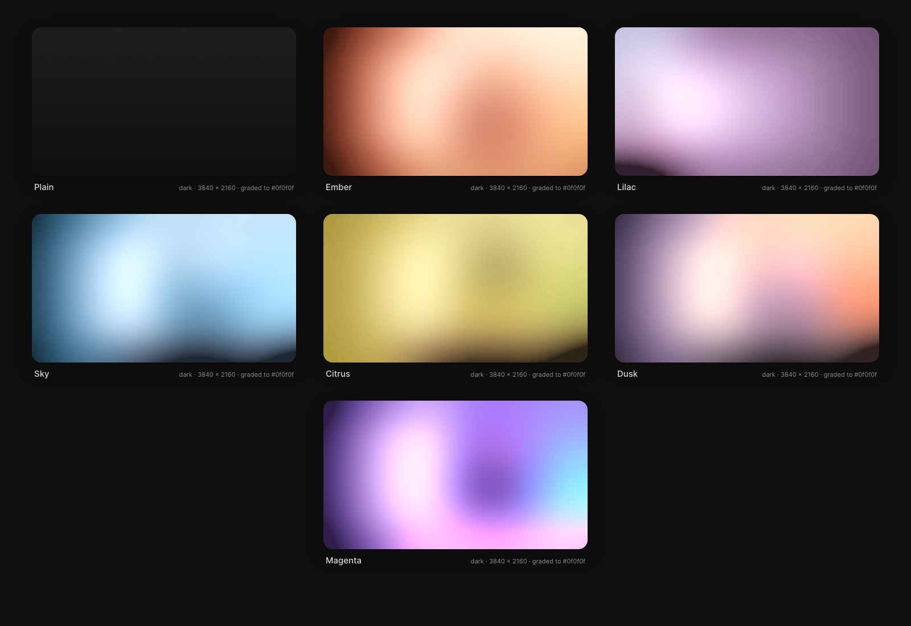

# Marvin

A design system for [Omarchy 4](https://omarchy.org), delivered as a theme,
a reversible config layer, and fourteen restyled widgets.

Omarchy's stock look is assembled rather than designed: an irregular spacing
ramp, six type sizes crammed between 10 and 16px, every surface the same
colour with a gradient border doing the work of depth, hover and keyboard
focus drawn identically. Marvin replaces that with a small number of rules
and applies them everywhere — the bar, every popup, the launcher,
notifications, the lock screen, the window manager's motion — so the desktop
reads as one object.

Named for [Marvin Schwaibold](https://x.com/MSchwaibold). The method —
understand the grid, set a clean type scale, art-direct a few key widgets,
then propagate — is his, and his widget studies are the visual reference. He
is not involved in this project; the name is a credit, not an endorsement.



Sixty-three wallpapers ship, and the wallpaper is the ground the whole
system sits on. Seven are gradient rooms drawn from the palette — lit boxes
in perspective, now fully blurred into soft colour fields and graded so the
bar and every card read as surfaces over them. The other fifty-six are soft
colour abstractions. The plain ground comes first, so an empty desktop reads
exactly like the widget sheet.


The launcher, notification, OSD and the restyled widgets at the token
values. Tone is a property of each surface: weather is a gradient, the
battery card is inverted with a ring of ticks, state is a soft-fill chip,
and the rest stay quiet.


The wallpaper is the ground the whole system sits on — an empty workspace
with one notification, then the shipped backgrounds themselves:


These are renders from the tokens, not screenshots of the shell — see
[Testing it](#testing-it).

## The system in one screen

| | Rule | Value |
|---|---|---|
| **Grid** | base 4, module 8, unit 32 | bar 32; rows and controls 40 |
| **Radius** | one radius for everything | 24px — cards, windows; controls are pills |
| **Padding** | equals the radius | 24px, so content sits at the centre of the corner arc |
| **Type** | Inter, pinned scale, every step perceptible | 12 / 14 / 16 / 18 / 24 / 56; hero numerals regular weight, tracked −0.03em |
| **Colour** | true-neutral ramp, one accent, one attention role | one sky blue, `#2f93d3` light / `#6db8ee` dark, pulled from the reference and used for accent and attention alike; status is muted text, or the reference's pale-yellow draft chip |
| **Text** | two tones, no third | foreground and muted |
| **Depth** | surfaces, not outlines | a hairline at 10% and a wide faint shadow; no dividers, no structural borders |
| **Tone** | a property of each surface | bar is base, popups are raised, weather is a sky that follows the hour (day, sunset, night), battery is inverted |
| **State** | emphasis rises in one direction; focus ≠ hover | fills 0.04 → 0.05 → 0.07 → 0.09 in light (0.06 → 0.10 → 0.14 → 0.18 in dark); focus is the selected fill plus a 1px text-colour ring, never an accent outline |
| **Progress** | a hairline | 2px, track at 0.08, fill muted (the reference's played portion is mid-grey) or accent |
| **Motion** | a scale, exits faster than entrances | 120 / 200 / 320 ms, exits at 0.6; workspaces slide, borders don't linger |
| **Icons** | Material Design Icons on their own grid | 16 / 20 / 24 |

Every one of those is measured, not eyeballed: contrast floors, parser
compatibility, dark/light geometry identity and the install/revert round-trip
run under `./test/run`. The reasoning behind each rule, and what is still
open, is in [`docs/principles.md`](docs/principles.md). How the pieces fit
together is in [`docs/system.md`](docs/system.md).

## Install

### 1. The theme

```
omarchy theme install https://github.com/adamperlis/omarchy-marvin
omarchy theme set marvin
```

This alone gives you the palette, the grid, the type scale, hairline
surfaces, the state model, quiet neutral window borders, wallpapers, and the
boot logo. It is everything a theme file can carry, and it has to look
intentional by itself — a plain install is the honest baseline.

What a theme file *cannot* carry in Omarchy 4: window rounding and gaps, the
shell's typeface, shadows, compositor motion, and widget layouts. Those are
the config layer.

### 2. The config layer

```
~/.config/omarchy/themes/marvin/install/marvin
```

Adds, in order:

- **`marvin-light`** — the same geometry over a light tone table.
  `omarchy theme set marvin-light` to switch.
- **Inter for the shell** — through a fontconfig rule scoped to the shell's
  process, so your terminal font is untouched and `omarchy font set` keeps
  working. Inter and Libre Baskerville are installed to your user font directory
  from `fonts/`; no package, no `sudo`.
- **Hyprland** — rounding 16, gaps 8 inside and 16 at the edge, a 1px
  theme-coloured focus border, a shadow in place of surface outlines, and
  the motion scale. Written to `~/.config/hypr/marvin.lua` and required from
  your `hyprland.lua` by one marked line; nothing else of yours is edited.
- **Widgets** — all fourteen plugins, enabled if the shell is running.

Before it changes anything, it snapshots every file it will touch and the
theme that was active. `install/marvin --status` shows what is installed and
what the snapshot holds.

### 3. Widgets by hand

If you would rather enable them one at a time (recommended for a first
test), skip the installer's enable step and:

```
omarchy-shell shell rescanPlugins
omarchy plugin enable marvin.weather      # then marvin.clock, marvin.power, marvin.media …
```

Enabling a clone replaces the built-in in its bar slot; disabling it brings
the built-in back. Plugins are unsandboxed QML and land disabled so you can
read them first. See [`plugins/README.md`](plugins/README.md).

## Apps and surfaces

Everything in the grid above is a surface the system actually reaches:

| Surface | How | Where |
|---------|-----|-------|
| Bar, launcher, the Omarchy menu, clipboard manager, emoji picker, theme picker, notifications, OSD, tooltips, popups | `shell.toml` tokens — `[bar] [launcher] [menu] [image-picker] [notifications] [popups] [tooltip]` | theme |
| Every widget card — weather, clock, battery, media, audio, network, … | fourteen `clonedFrom` plugins | config layer |
| Lock screen, authentication dialog | `[lock]` and `[polkit]` tokens | theme |
| Notes (Obsidian) | `obsidian.css`, synced into every vault by Omarchy | theme |
| Screen-share picker | `hyprland-preview-share-picker.css` | theme |
| Files and every GTK app | Inter and the accent via `gsettings` | config layer |
| Windows: rounding, gaps, shadow, motion, group bar | `hypr/marvin.lua` | config layer |
| Terminals, btop, Chromium, VS Code, Claude Code, Helix, Neovim | colours from `colors.toml` through Omarchy's templates | theme |
| Boot splash | `unlock.png` | theme |

Notes get a serif for the text itself — Libre Baskerville, falling back to Noto
Serif — and Inter for everything around it. The reference does exactly this
and it is the one place a second voice belongs: the chrome is the system's,
the words are yours.

What could still be customised, and why it is not yet:

- **The login screen (SDDM)** — a fixed theme installed by root; reaching it
  needs `sudo` and a rebuild, which the config layer deliberately avoids.
- **GTK window chrome** — libadwaita accepts a `gtk.css` for header bars and
  sidebars, but rules there leak into every GTK app unevenly; font and
  accent through `gsettings` was the safe part.
- **Chromium, VS Code, Neovim, btop beyond colour** — each takes only a
  palette from a theme. Their own settings would carry the rest.
- **Firefox, Signal, Spotify, LibreOffice** — not themed by Omarchy at all.

The system reaches past the shell into the apps Omarchy installs, in two
ways:

- **Shipped by the theme**, so a plain install gets them: `obsidian.css`
  restyles the Notes app entirely — Inter, radius 16, borderless panes,
  neutral headings, chips for tags, monospace only inside code — and
  `hyprland-preview-share-picker.css` does the same for the screen-share
  picker. Omarchy syncs both into place on every theme switch.
- **Set by the config layer**, because they are settings rather than theme
  files: Files and every GTK app get Inter and the blue accent through
  `gsettings` (snapshotted, restored on revert), and Hyprland's group bar
  gets Inter at body size on a 32px row. The fonts themselves — Inter and
  Libre Baskerville, both OFL — are vendored under `fonts/` and installed per user,
  so nothing needs a package manager or `sudo`.

Everything else Omarchy templates — btop, Chromium, VS Code, Claude Code,
Helix, Neovim, the terminals — takes its colours from `colors.toml`
automatically, and colour is all those surfaces accept.

Monospace survives in exactly two places: terminals and code. Nowhere else.

## Put it back

```
install/marvin --revert
```

Restores every touched file byte for byte, removes what did not exist,
re-enables the built-in widgets, and sets your previous theme again. Then, if
you want the theme gone too: `omarchy theme remove marvin`. The only thing
left behind is the Inter package if the installer added it
(`sudo pacman -Rns inter-font`).

This is tested: `test/install-revert` installs against Omarchy's stock
config, simulates the shell enabling the clones, reverts, and fails unless
`~/.config` is identical to before.

## Testing it

Nothing in this repository has been rendered by the Omarchy shell — it was
built against upstream's source and scripts, not on a desktop. The first
real look is yours. [`docs/testing.md`](docs/testing.md) gives the order to
judge it in (theme alone, then config layer, then widgets one at a time with
the shell journal open) and what to send back.

## Repository map

| Path | What |
|------|------|
| `colors.toml`, `shell.toml`, `icons.theme` | The theme. Dark. |
| `obsidian.css`, `hyprland-preview-share-picker.css` | The Notes app and the share picker, restyled by the theme. |
| `light/` | The light sibling: same geometry, different tone table. |
| `backgrounds/`, `light/backgrounds/` | Wallpapers, graded to the ground. |
| `preview.png`, `preview-unlock.png`, `unlock.png` | Theme-switcher preview and the Plymouth boot logo. |
| `config/hypr/marvin.lua` | Rounding, gaps, border, shadow, motion. |
| `config/fontconfig/60-marvin-shell.conf` | Inter for `quickshell` only. |
| `install/marvin` | Installs the config layer; `--revert`, `--status`. |
| `plugins/marvin.*` | Fourteen restyled clones of the built-in widgets. |
| `tools/restyle.py` | The rules as a script; builds a widget from upstream's. |
| `tools/background.py` | Grades a painting (or a palette) into wallpapers. |
| `tools/appcss.py` | Generates `obsidian.css` and the share-picker stylesheet from `colors.toml`. |
| `fonts/` | Inter and Libre Baskerville, vendored under the OFL. |
| `tools/previews/build.py` | Renders `preview.png`, the boot screen and the widget sheets from the tokens (needs node + Playwright). |
| `test/run` | Every check. |
| `docs/system.md` | How the whole thing fits together, and how to change it. |
| `docs/principles.md` | Every design rule, confirmed or proposed, and why. |
| `docs/platform-constraints.md` | What Omarchy 4 lets a theme control, and what it doesn't. |
| `docs/testing.md` | The on-machine test plan. |
| `LICENSE`, `plugins/LICENSE-omarchy` | MIT, and Omarchy's MIT notice for the code the plugins reproduce. |

## License

MIT. Use it, fork it, change every value in it. The widget plugins and the
test fixtures contain Omarchy's own code, which is also MIT; its notice
travels with them in `plugins/LICENSE-omarchy`.

## Backgrounds

The wallpaper is the ground the whole system sits on, so it is graded, not
chosen: saturation pushed up a little so the field stays rich, mixed lightly
toward the theme ground, luminance clamped into a band the bar stays
readable over, grain added against banding.

Sixty-three backgrounds ship. The first is no image at all: the reference's
own ground, white falling to the base grey, so the desktop reads exactly
like the widget sheet. The next six are lit rooms, drawn by
`tools/background.py` at 4K, nothing borrowed: a box in perspective whose
walls, floor and ceiling are gradient planes converging on a small door or
window at the far end, light blooming from it, a whisper of grain — then
fully blurred, so each room reads as a soft field of its own colour rather
than a hard-edged box. The same six, ungraded and left sharp, are the
imagery inside the widgets (`docs/images/art/`): album art, thumbnails,
screen-share previews, the mood board. The remaining fifty-six
(`backgrounds/abstract-*.jpg`) are soft colour abstractions, cover-cropped
to 3840 × 2160 and compressed — no grading and no extra blur, since they are
already fields. Every wallpaper is selectable from Omarchy's switcher.

| | Background | Colours |
|---|---|---|
| 1 | Plain | the ground itself, `#ffffff` → `#ebebeb` light, `#1e1e1e` → `#0f0f0f` dark |
| 2 | Ember | orange walls, peach ceiling, a glowing amber door |
| 3 | Lilac | lilac and pink, a dark doorway |
| 4 | Sky | the accent blue, a navy floor, a pale window |
| 5 | Citrus | yellow and lime over an orange floor |
| 6 | Dusk | violet meets orange, a pink door |
| 7 | Magenta | violet, cyan and magenta, an orange-edged door |

The gradient rooms are original, so they carry this repository's licence. The
fifty-six abstractions are external images added as wallpapers — confirm you
have the right to redistribute them before publishing a fork. To draw more
rooms, or to grade a painting or photo of your own:

```
tools/background.py --style corridors --palette sky --index 8 --seed 21 --blur 0.16 --crop-out docs/images/art
tools/background.py --source path/to/yours.jpg --name mine --index 9 --blur 0.045 --crop-out docs/images/art
```

Seven palettes are built in (`ember lilac sky citrus dusk tide magenta`);
every seed is a different room. Rooms now ship fully blurred — a Gaussian
radius of 0.16 × the height, so each reads as a soft field; a painting gets
a 4.5 % blur so the desktop stays a field. The `--crop-out` crop is taken
before the blur, so the UI art stays sharp.

It writes both tones. Needs Pillow and numpy.
